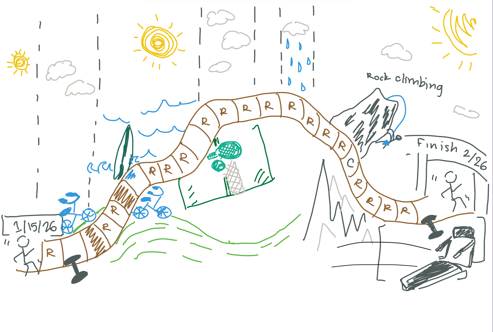
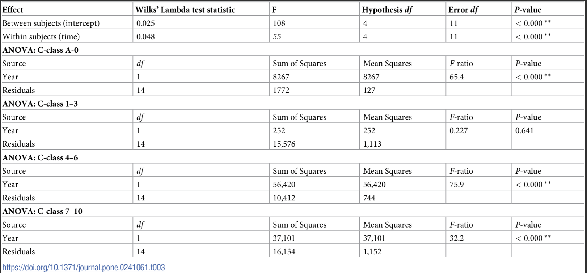

[My GitHub Repository](https://github.com/talularwilmot/ENVS-193DS_homework-03.git)

```{r}
#| label: read in packages and data
#| message: false
#read in packages from library 
library(tidyverse)
library(here)
library(janitor)
library(readxl)
#read in data from data folder 
salinity <- read.csv("~/Desktop/ENVS 193DS/Homeworks/Homework 3/ENVS-193DS_homework-03/data/salinity-pickleweed.csv")
Personal <- read_csv("~/Desktop/ENVS 193DS/Homeworks/Homework 3/ENVS-193DS_homework-03/data/My Data ES 193 - Sheet1.csv") #read in my data and relabel 
```

# Problem 1. Slough soil salinity

## a. An appropriate test

The two appropriate tests to determine the strength of the relationship between salinity and California pickleweed biomass are **Pearson’s correlation** and **simple linear regression**. Pearson’s correlation simply measures the strength and direction of the linear relationship between two continuous variables salinity and California pickleweed biomass. The simple linear regression treats salinity as the independent (predictor) variable and biomass as the dependent (response) variable, quantifying how much biomass changes with salinity and allowing prediction of biomass from salinity.

## b. Create a visualization

```{r}
#| label: initial visualization of data
#gg plot visualization 
ggplot(data = salinity, #use salinity data 
       aes(x = salinity_mS_cm, #salinity is predictor 
           y = pickleweed)) + # pickleweed is respinse 
  geom_point(color = "chartreuse4") + #use different color for points 
  labs(x = "Soil salinity (mS/cm)", #use labels for points that inlcude units 
       y = "Pickleweed biomass (g)") + 
  theme_classic() #change theme 
```

## c. Check your assumptions and run your test

### Run test

```{r}
salinity_model <- lm( #use linear regression to test for relationship 
  pickleweed ~ salinity_mS_cm, # formula: response ~ predictor
  data = salinity # data frame
  ) 
summary(salinity_model) #show summary of test 
```

### check assumptions

```{r}
par(mfrow = c(2, 2))
plot(salinity_model)
```

I checked the assumptions of normality of residuals using QQplots, and homoscedasticity using residual vs. fitted and scale-location. The QQplot follows a linear trend showing normality of residuals, and both residuals vs. fitted and scale location show random distribution or residuals around the horizontal line demonstrating homoscedasticity.

## d. Results communication

To evaluate the strength of the relationship between pickleweed biomass and soil salinity, I used a simple linear regression because because both variables (soil salinity in mS/cm and pickleweed biomass in grams) are continuous, and I was specifically testing whether salinity predicts changes in biomass. The test showed that soil salinity was significantly correlated to pickleweed biomass (linear regression, F(1, 21) = 8.40, R^2^ = 0.25, p = 0.009, ⍺ = 0.05). From our model coefficient estimates we predict that for each 1 mS/cm increase in soil salinity pickleweed biomass increases by 2.1 ± 0.7(SE) g.

## e. Test implications

Our simple linear regression indicates a significant positive linear relationship between salinity (mS/cm) and pickleweed biomass (g) (linear regression, F(1, 21) = 8.40, R^2^ = 0.25, p = 0.009, ⍺ = 0.05), meaning that inorder for pickleweed plants to be successful they need to be in saltier conditions. This means that in the event of extreme rain or freshwater input plants may struggle to survive and potentially artificial salt addition may be necessary. This study would benefit from further sampling to solidify this relationship, but without a visible plateau in our linear model out planters should lean towards \~7.0 (mS/cm) (where highest pickleweed biomass was recorded) and above.

## f. Double check your own work

```{r}
cor.test(salinity$salinity_mS_cm, salinity$pickleweed, #use salinity data to test for correlation
         method = "pearson") #use pearson correlation test 
```

The cor.test also shows significant correlation between salinity (mS/cm) and pickleweed biomass (g) (cor = 0.53, t(21) = 2.90, p = 0.009, ⍺ = 0.05). These results led us to the same conclusion of rejecting the null hypothesis that there is no relationship between the variables, however this test does not provide any direction of correlation or differentiate between predictor and explanatory variables, like the linear regression allows for.

# Problem 2. Personal data

## a. 

```{r}
#| label: Visualization Categorical

personal_clean <- clean_names(Personal) #clean column names in personal data 

ggplot(data = personal_clean, #use personal data 
       aes(x = workout_type, # x-axis
           y = duration,# y-axis
           color = workout_type)) + # color by workout type 
geom_jitter(height = 0, # no jitter in the vertical direction
            width = 0.3, # smaller jitter in the horizontal direction
            alpha = 1, # make the points more transparent
            shape = 20, #closed circle shape 
            size = 4) + #enlarge the shape of the points 
scale_color_manual(values = c("Running" = "aquamarine3",  #give a unique color to each type of workout 
                              "Biking" = "cyan4", 
                              "Gym" = "slateblue", 
                              "Surfing" = "blue", 
                              "Climbing" = "darkorange", 
                              "Tennis" = "green")) + 
labs(title = "Duration of the workout based on type of exercise completed", #title 
      x = "Workout Type", #x-axis title 
      y = "Duration (hr:mm:ss)", 
     subtitle = "2/26/2026") + #y-axis title including units
 theme_bw() + #theme black and white 
 theme(legend.position = "none", # getting rid of the legend
       plot.title = element_text(size = 12)) # making the title font smaller
```


### Extra Analysis for personal interest 
```{r}
#| label: Visualization Continuous
running_data <- personal_clean %>% #use to personal_clean data and filter to only include rows with the workout type equal to running 
  filter(workout_type == "Running") 
ggplot(data = running_data, #use the clean name version of personal data 
       aes(x = distance_mi, # x-axis
           y = pace)) + #y-axis
geom_point(color = "cornflowerblue") +#color the points
labs(title = "Running Mileage vs. pace", #title 
     x = "Distance (mi)", #x-axis title
     y = "Pace (h:mm:ss)", #y-axis title 
     subtitle = "2/25/2026") + #add subtitle that is the date of the last recorded observation 
theme_minimal() + #different theme from default 
theme(plot.title = element_text(size=12))  #change title font size
```

## b. Captions 

**Figure 1. Jitterplot of workout duration categorized by type of workout** Points represent measurement for duration of workout and are colored according to workout type: Biking, climbing, gym, running, surfing, tennis. Data collected by the author from 1/15/2026 - 2/26/2026. Accessed via csv download. 

**Figure 2. Scatterplot of running distance against average pace for the duration of the workout** Blue points represent average pace of workout (h:mm:ss) at different mileage totals. Data were collected by the author from 1/15/2026 - 2/25/2026 as noted in subtitle. Accessed via csv download. 

# Problem 3. Affective Visualization 

## a. 

For my personal data I am thinking of doing a watercolor painting with black pen illustrating parts of the painting. I plan on having a path meander through the center of the page representing running as the focal point of my workouts and also a representation of time. Each block on the path will represent a day that an activity was recorded with points points that are not running having a distinct icon, and a a runner at the start and the end line to represent how workout went all the way through. In order to include more variables like workout duration and pace, the shade of the block will represent the duration of the workout with darker shades showing longer duration. Outside of the blocks the depiction of the weather above them will represent the weather on the day of that activity. 

## b. Sketch 



## c. Rough Draft  


## d. Artist Statement 

My piece is demonstrating the journey of my workouts over the course of this quarter with an emphasis on running throughout. In my medium and presentation I took inspiration from Jill Pelto's paintings as they also use water color to depict statistical trends. I created this work by first doing some very light sketching just to outline the painting followed by water color to do the bulk of the picture, blocking it out and adding color and the finer details I used black pen. 

## e. Link 

[View](https://docs.google.com/presentation/d/1bZh40zt9ZVkJDKZNU7cD2fJyYqCPFJibfgQmomVobtk/edit?slide=id.p#slide=id.p)


# Problem 4. Statistical crituqe

## a. Revisit and summarize

An ANOVA or analysis of variance test is included in this paper as well as a Multivariate analysis of variance or MANOVA. The predictor variable is the year, and the response variable is the cover of species within a respective conservatism class (A-0, 1-3, 4-6, 7-10) that indicates how able to species is to thrive in altered environments. The ANOVA test used in this study addresses the question presented by the author by establishing if there was a significant change in species composition over the period of interest. A significant result would be a significant change in each conservatism class size between 1986 and 2019. 



## b. Visual clarity

The table clearly represents the data from the tests by appropriately labeling and organizing all information by conservatism class. This allows for the reader to start by looking at the overall or MANOVA results at the top and then go through each class to see if there was significance at each level. I will say the MANOVA is not clearly labeled forcing the reader to look at the caption to understand the first few rows.

## c. Aesthetic clarity

The authors did a good job at mitigating visual clutter but there is some repetition present. For ANOVA conservatism class is bolded and clearly not part of the table depicting results which is good. For the MANOVA the variables are also bolded but this section is not titled. Additionally variables for the ANOVA are not bolded and are re-listed for every conservatism class which is a bit repetitive. Significant results are signaled with an asterisk but that information is also repetitive as the p-value being so small clearly shows significance.

## d. Recommendations 

Firstly I would actually separate the MANOVA and ANOVA tables and add a title to the section displaying the MANOVA results so that it is uniform with the titles of the ANOVA results and differentiates it as a separate test. I would also bold the variables used in the ANOVA test and only list them once on the table as they remain the same for each proceeding test. Finally I would shrink the column for degrees of freedom as it has a lot of empty space and remove the asterisk from the p-value instead listing it as \<0.001.
